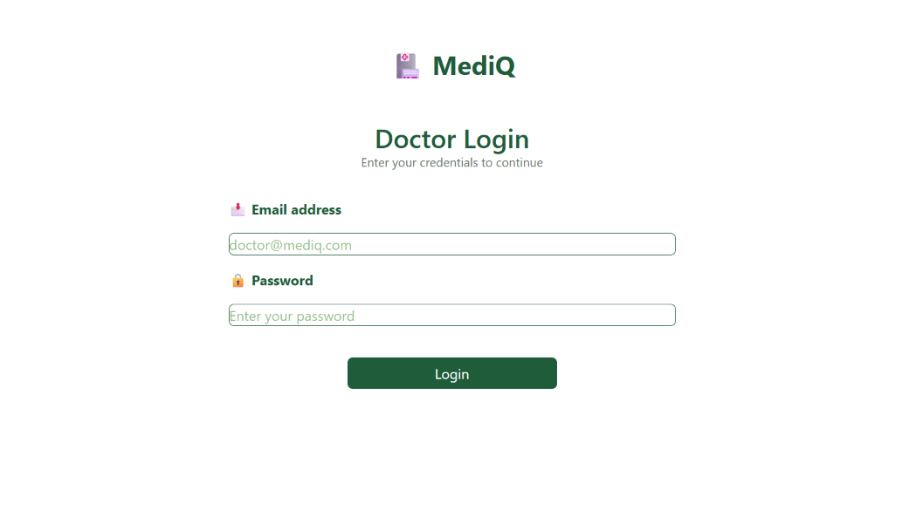
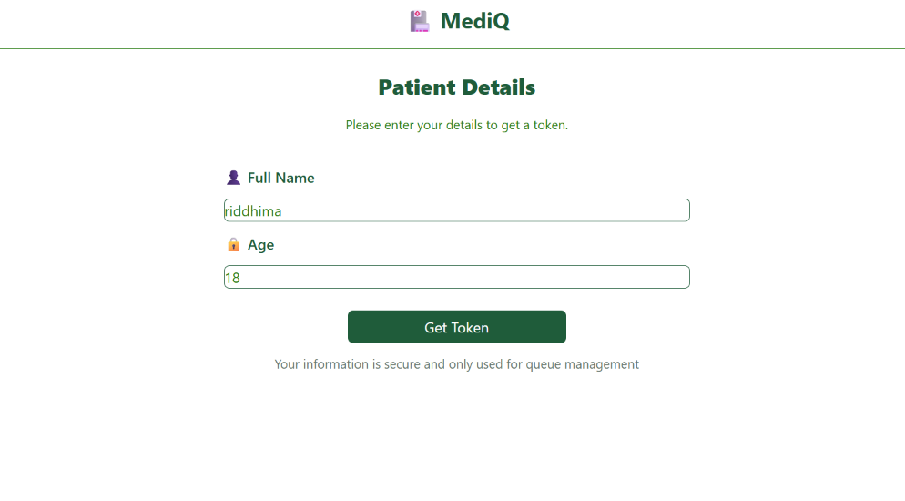
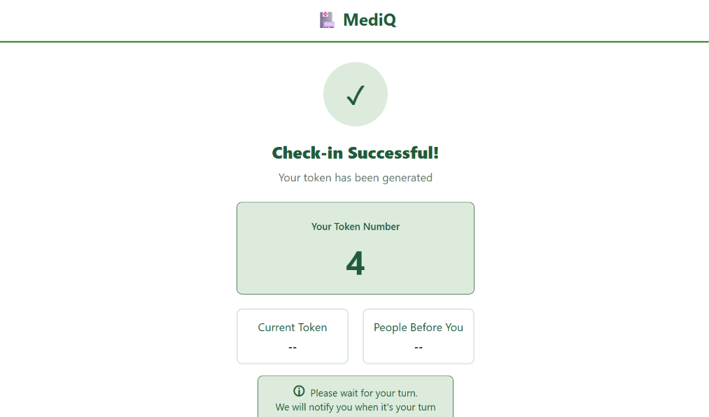
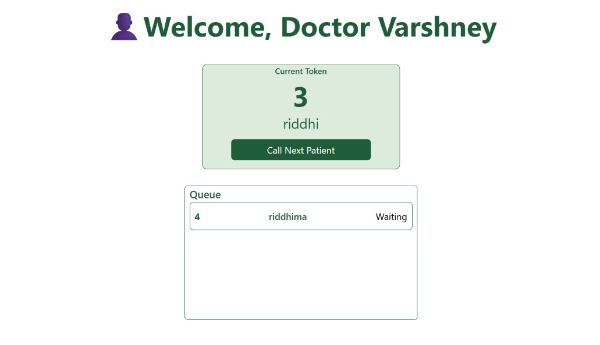
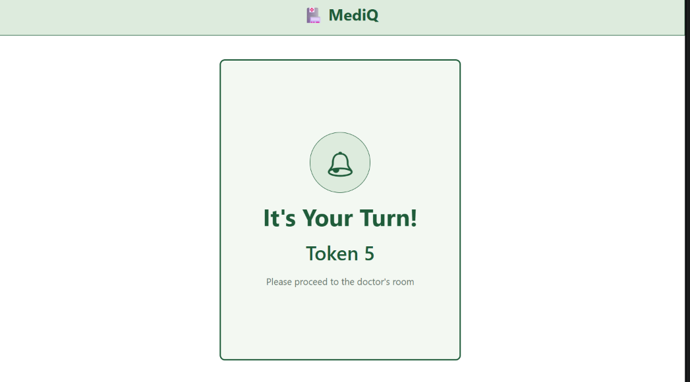

# MediQ 🏥

MediQ is a clinic queue management system designed to reduce waiting-room congestion, make patient queues easier to manage.

Patients can join the queue by scanning/tapping an NFC point at the clinic, receive a token, and wait without needing to repeatedly check with reception. Doctors can view the live waiting queue and call patients when it is their turn.

---

## ✨ Features

### 👤 Patient

- Join the clinic queue through the patient flow
- Enter basic details such as name and age
- Receive a unique queue token
- View the current queue status
- Get an instant "It's your turn" notification when the doctor calls their token
- Patient identification is handled without requiring a separate account/login

### 👨‍⚕️ Doctor

- Secure doctor login using Supabase Authentication
- View the current waiting queue
- See patient names and token numbers
- Call the next patient
- Automatically update the patient's queue status

### ⚡ Real-time Queue Updates

MediQ uses Supabase Realtime to communicate queue status changes between the doctor dashboard and patient interface.

When a doctor calls a patient:

```text
Doctor Dashboard
       ↓
Patient status → "called"
       ↓
Supabase Database Trigger
       ↓
Realtime Broadcast
       ↓
Patient's Browser
       ↓
"It's your turn!"
````

The patient does not need to manually refresh the page.

---

## 🛠️ Tech Stack

### Frontend

* React
* Vite
* Tailwind CSS
* JavaScript

### Backend / Database

* Supabase
* PostgreSQL
* Supabase Authentication
* Supabase Realtime
* Row Level Security (RLS)

### Other

* NFC-based entry point
* Browser LocalStorage for maintaining the current patient's queue session

---

## 🔄 How It Works

### 1. Patient joins the queue

The patient taps the clinic's NFC point, which opens the MediQ patient interface.

They enter:

* Full name
* Age

MediQ requests the next available queue token and stores the patient information in Supabase.

### 2. Token is generated

A PostgreSQL function generates the next queue token.

Example:

```text
Token 1
Token 2
Token 3
...
```

The patient's token is also temporarily stored in LocalStorage so the browser knows which queue entry it is currently following.

### 3. Doctor views the queue

The doctor logs into the dashboard and sees patients whose status is:

```text
waiting
```

Patients are displayed in the order in which they joined.

### 4. Doctor calls a patient

When the doctor clicks **Call Next Patient**, the patient's status changes:

```text
waiting → called
```

The patient remains stored in the database for record keeping.

### 5. Patient is notified

A Supabase database trigger broadcasts the status change to the patient's specific Realtime channel.

The patient's interface automatically changes to:

> **It's your turn!**
> Please proceed to the doctor's room.

---

## 🗄️ Database Structure

MediQ currently uses a `patients` table.

| Column       | Type      | Description                |
| ------------ | --------- | -------------------------- |
| `id`         | UUID      | Unique patient queue entry |
| `name`       | Text      | Patient's name             |
| `age`        | Integer   | Patient's age              |
| `token`      | Integer   | Queue token number         |
| `status`     | Text      | Current queue status       |
| `created_at` | Timestamp | Time the patient joined    |

### Patient Status

```text
waiting
   ↓
called
```

The database keeps the patient record after they are called instead of deleting it.

---

## 🔐 Security

MediQ uses Supabase Row Level Security (RLS) to control access to patient data.

* Anonymous users can add themselves to the queue.
* Authenticated doctors can update patient queue status.
* Patient information is not exposed through an unrestricted anonymous read policy.
* Realtime notifications contain only the information required to notify the relevant patient.

> This project is currently an MVP/prototype. A production deployment would require additional security measures such as stronger role-based access, rate limiting, improved patient verification, and stricter multi-clinic access control.

---

## 📁 Project Structure

```text
MediQ/
│
├── src/
│   ├── lib/
│   │   └── supabaseClient.js
│   │
│   ├── App.jsx
│   ├── main.jsx
│   └── ...
│
├── .env.local
├── .gitignore
├── package.json
├── vite.config.js
└── README.md
```

Environment variables are stored locally and are **not committed to GitHub**.

Example:

```env
VITE_SUPABASE_URL=your_supabase_url
VITE_SUPABASE_PUBLISHABLE_KEY=your_supabase_publishable_key
```

---

## 🚀 Getting Started

### Prerequisites

Make sure you have:

* Node.js installed
* A Supabase project
* Git installed

### Installation

Clone the repository:

```bash
git clone https://github.com/riddhimacodes17/MediQ.git
```

Navigate into the project:

```bash
cd MediQ
```

Install dependencies:

```bash
npm install
```

Create a `.env.local` file:

```env
VITE_SUPABASE_URL=your_supabase_url
VITE_SUPABASE_PUBLISHABLE_KEY=your_supabase_publishable_key
```

Start the development server:

```bash
npm run dev
```

---

## 🎯 Current MVP Scope

The current version focuses on the core clinic queue workflow:

```text
NFC Entry
    ↓
Patient Details
    ↓
Token Generation
    ↓
Waiting Queue
    ↓
Doctor Dashboard
    ↓
Call Next Patient
    ↓
Real-time Patient Notification
```

---

## 💡 Why MediQ?

Traditional clinic queues often require patients to physically wait and repeatedly check with the receptionist whether their turn has arrived.

MediQ aims to make this process simpler by allowing patients to:

**Join → Receive a token → Wait → Get notified → Visit the doctor**

while giving doctors a simple interface to manage the queue.

---
## Screenshots






## 👩‍💻 Author

**Riddhima Agarwal**

Built as a React + Supabase project to explore real-time web applications, authentication, database integration, and queue management systems.

## Demo doctor login credentials
Demo email- doctor@mediq.com
demo password- Pass123
